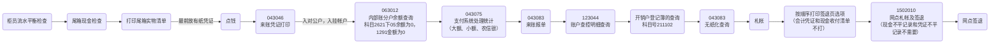

# 柜员操作手册

## 存取款

**金额 >= 50000 || 代理人 >= 10000 || 未成年人 >= 5000 需提供身份证，未成年人额外提供户口本（户主页，监护人页，本人页）**

1. **011003** 活期存款支取（存钱）

   ``` mermaid
   graph LR
   A[刷卡] --> B{是否本人？}
   B --> |是| C(签字或手印)
   B --> |否| D(代理人身份信息)
   D --> |签代理人| E(拍照)
   E --> C
   C --> |按手印有人像材料| F[给钱]
   ```

2. 存钱

##  代缴

**121013** 单笔实时缴费

1.  医社保 代码309 两险**

   尾数150社保，交当年

   位数310医保，交次年

   ``` mermaid
   graph LR
   A(身份证号) --> B(缴费年度) --> C(手机号) --> D(签字或手印) --> E(打印凭证)
   ```

   

## 账户相关

1. **013013** 明细账查询打印

   查询人提供身份证并打印身份证签字

2. **072013** 借记卡改密

   1. 有卡改密

      ``` mermaid
      graph LR
      A(有卡改密) --> B(拍卡拍人) --> C(人脸识别) --> D(远程授权) --> E[改密]
      ```

   2. 无卡改密

## 领卡换卡

1. **073620** 社保卡|保号换卡登记簿查询

2. **072004** 领卡

   ```mermaid
   graph LR
   A(身份证) --> B(人脸核验) --> C(远程核验) --> D[给卡]
   ```

3. **012080** 非柜面限额管理

   正常限3000，限额>5000需要审批

## 手机银行相关

1. **132011** 个人签约维护

   设备重置 密码重置 修改（开通转账功能等） 认证管理 转账限额解锁

## 签退流程



